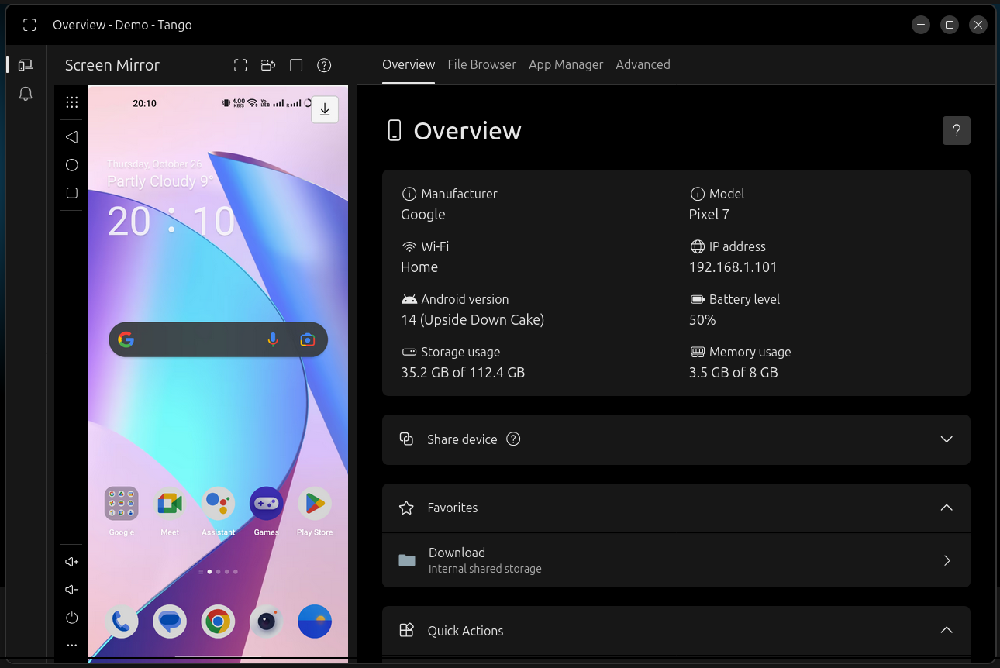
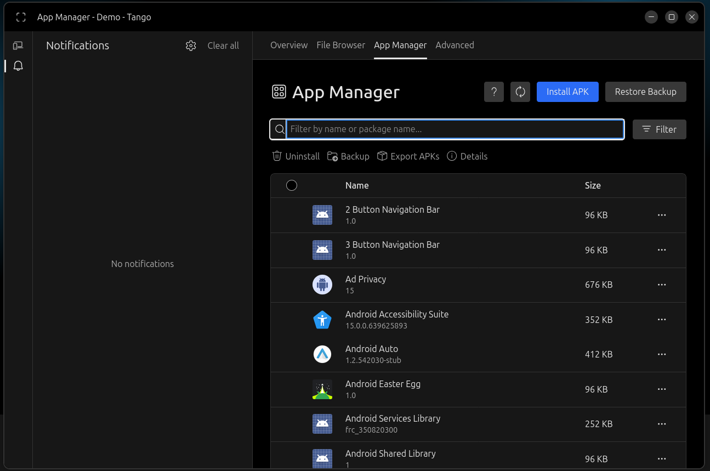
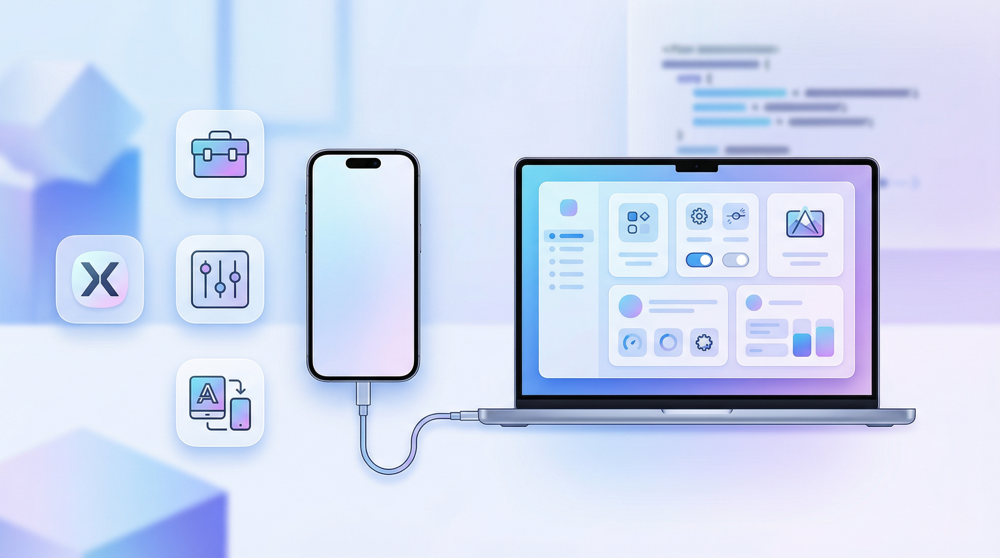

ADB is a powerful tool that you can use to control your Android device and tweak hidden settings, but the command line can be too complicated for many.

These apps offer a GUI for ADB, allowing you to make use of ADBs powerful functionality without having to use the terminal.

- - -

:::box[Best picks]
- No setup needed: [**Tango ADB**](#tango)
- Most powerful Windows app: [**ADB AppControl**](#adb-appcontrol)
- Most powerful cross platform app: [**Xtreme ADB**](#xtreme-adb)
- Slickest app: [**Android Toolbox**](#android-toolbox)
:::

- - -

### Tango

A brand new way of managing Android devices

:::details[Features]
#### Instant
Plug in your android device with a USB cable and you are ready. No need for download or installation.

#### Secure
Tango works entirely in your browser. All data is transferred directly between your Android devices and your browser.

#### Powerful
File browser, App manager, Screen mirror and more features are waiting to be explored...
:::

#### Platforms:

- **Chrome:** Yes 
- **Firefox:** No 
- **Windows:** Yes 
- **Linux:** Yes 
- **MacOs:** Yes 

**Licensing: Freemium, FOSS**   

:::grid[Screenshots]

.png)

:::

https://app.tangoapp.dev

https://github.com/yume-chan/ya-webadb

---

### Android Toolbox

Android-Toolbox is a desktop app which enables the user to access android device features which are not accessible directly from the mobile device.

:::details[What does it do?]

##### Current features:

- You can now perform some file management tasks (External SD card supported)
- Reboot to system, recovery, fastboot, bootloader or simply power off using the power controls
- You can offload, suspend, un-suspend, install, uninstall, kill or recompile apps._(Apps are currently shown as package names only. I couldn't find a way to get app titles without pushing aapt to the mobile device.)_
- Support for installing split apks and batch install apk*(Coming Soon)*
- **Bloatware or other system apps can now be uninstalled**
- **Full Windows Subsystem for Android (WSA) compatibility (WSA is retiring on March 5, 2025)**
- _More soon......_
  :::

##### Platforms:

- **Windows:** Yes 
- **Linux:** Planned 
- **macOs:** Yes 

**Licensing: FOSS** 

:::grid[Screenshots]

:::

https://github.com/lightningbolt047/Android-Toolbox

---

### ADB AppControl

**ADB AppControl** is a powerful application manager for Android.
It offers a clean and modern graphical interface for working with ADB and automates batch operations to manage apps across Android device.

:::details[Features]

#### App Control

- Disable and uninstall applications without root
- Multiple apps installing
- Full Split installation support (APKS)
- Saving APK files of installed applications
- Permissions Manager for applications
- Saving and loading applications list-presets
- Quick search for apps on Google Play, ApkMirror, F-Droid and others

#### Useful tools

- Displaying device information
- Changing the screen resolution and DPI
- Hiding icons in the status bar
- Device remotely control
- Virtual volume, power, camera and navigation buttons
- Creating screenshots of the device screen
- Quick reboot in recovery and bootloader

#### Advanced

- ADB Console with favorites commands
- Fastboot support
- Logcat logs
- Auto permission granting for popular apps (Tasker, Battery Stats, etc.)
- Simple file upload
- Extended Settings
  :::

#### Platforms:

- **Windows:** Yes 
- **Linux:** No 
- **macOs:** No 

**Licensing: Freemium**  

:::grid[Screenshots]

:::

https://adbappcontrol.com/en

---

- - -

### Xtreme ADB

The Ultimate ADB GUI Wrapper. Manage your Android devices with ease — no terminal required.

:::details[Features]

- **Modern UI:** A clean design with full Light/Dark mode support.
- **Live Dashboard:** Real-time monitoring of Battery and RAM.
- **App Manager:** Bulk install APKs, uninstall system apps, force stop, and extract APKs to PC.
- **File Explorer:** Full GUI file manager to Copy, Paste, Rename, Delete, Upload, and Download files.
- **Fastboot & Recovery:** Boot live images without flashing, flash recovery/boot, and sideload ZIPs.
- **Wireless ADB:** Built-in pairing tool for Android 11+ (Pairing Code support) and TCP/IP toggler.
- **Tweaks:** Change DPI, Resolution, Animation Scales, and toggle visual pointers.
- **Backup & Restore:** Create full system backups (`.ab` files) and restore them.
- **Logcat:** Color-coded (\*In Dark Mode only) real-time log stream to easily spot errors.
  :::

##### Platforms:

- **Windows:** Yes 
- **Linux:** Yes 
- **macOs:** Yes 

**Licensing: FOSS** 

:::grid[Screenshots]

:::

https://kpr-man.github.io/XtremeADB

https://github.com/KPR-MAN/XtremeADB

---

### ATA GUI

ATA-GUI is an app that lets you perform advanced tasks on your Android™ device with ease. You can use ATA-GUI to access and modify your device's system settings, files, and features. You can also use ATA-GUI to install, uninstall, and restore apps on your device.

:::details[Features]

- **Manage System/User Applications Without Root:**
  - Uninstall applications
  - Clean data
  - Enable/disable apps
- **Install Applications and Upload Files Seamlessly**
- **Check and Manage Permissions for Any Application**
- **ADB Over Network with Easy and Fast Pairing**
- **Detect and Remove Bloatware**
- **Reboot into Recovery, Fastboot, and System Modes**
- **Flash and Extract Images**
- **Erase User Data and Cache**
- **Screen and Camera Mirroring**
- **Unlock and Lock Bootloader** (device dependent)
- **Extract Device Information in System and Fastboot Modes**
- **Sideload ZIP Files Easily**
- **Execute Custom Commands**
- **Inject Text**
- **Access and Analyze Logcat**
- **Integrated Task Manager**
- **Grant WRITE_SECURE_SETTINGS and DUMP Permissions**
- **Retrieve OEM Device ID**
- **Support for Multiple User Devices**
- **Support for enviroment variables**
- **Auto USB device detection**
  :::

#### Platforms:

- **Windows:** Yes 
- **Linux:** No 
- **macOs:** No 

**Licensing: FOSS** 

https://github.com/msartore/ATA-GUI

---

### AYA

AYA is a desktop application for easily controlling android devices, which can be considered as a GUI wrapper for ADB.

:::details[Features]

- Screen mirror
- File explorer
- Application manager
- Process monitor
- Layout inspector
- CPU, memory and FPS monitor
- Logcat viewer
- Interactive shell
  :::

#### Platforms:

- **Windows:** Yes 
- **Linux:** Yes 
- **macOs:** Yes 

**Licensing: FOSS** 

:::grid[Screenshots]

:::

https://github.com/liriliri/aya

https://aya.liriliri.io
