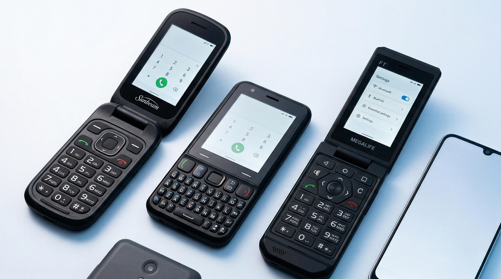

## About the kosher tech world

From the wide variety of dumbphones out there, there are ones designed to be kosher phones. Although they're often not designed specifically for the digital detox community, a lot of what the kosher and minimialist tech users want intersect, and these phones can be great options for many of us.

### What are kosher phones?

Some of you might be asking, *"isn't kosher for food?"*
The answer is that yes, traditionally kosher was only used to describe food, but over time it evolved to refer to other things that meet Jewish laws and standards, including modern tech.
Kosher phones refer to a wide spectrum of phones that meet certain standards, having internet access filtered or blocked, and very often being traditional dumb phones.
They're sometimes regular smartphones or dumbphones that have restrictions installed onto them by technicians, and there are others that are built kosher from the factory.

### What does the kosher tech world have to do with digital minimalism?

The Orthodox Jewish Community shares many beliefs about modern tech with the digital detoxing community.
They believe that a lot of apps and online content can be very damaging.
They believe that 24/7 online access and usage is bad for you.
That the less you can use tech, the better.
That life is better offline.
That using digital technology, and for some people, smartphones, is inevitable in the 21st century, but it should be used as minimally and wisely as possible, with restrictions and devices designed to prevent overuse.

They've designed many apps and filters to help with this.
Some filter internet connectivity, others can block specific apps, and others lock phones down to just talk and text or laptops to just offline use.

These can be useful for anyone trying to regain control of their tech usage and learn healthy digital habits.

---

## Phones that are made kosher from factory

Okay, now diving into what kosher phones are actually like.

I'm going to focus on phones that are made kosher from the factory.

### What do these phone restrict, and what do they allow?

These phones never have browsers.

They block app installation.

They usually don't allow WhatsApp, although some do.

They don't allow Spotify or YouTube, although some allow Jewish music streaming services.

Some have email, navigation, hotspot, Android Auto, banking, and offline video capabilties, others restrict some or all of those.

They usually have simple offline apps, like a notepad, caculator, file manager, etc., the basic apps that dumbphones usually come with.

Most have texting and offline media features, although some offer option with those features removed.

Many block calling and texting AI.

### How much do these phones cost?

They usually cost from around $200 to $400.

The companies making them are very small, and it's very expensive to manufacture a custom device, so they're forced to charge that much just to make a normal profit.

They do not have huge profit margins.

They are not trying to rip you off.

Yes, I agree the prices aren't great and might not be very affordable for some, but it is what it is.

---

## The best Kosher phones

I'm going to be focusing on the best kosher phones that are made custom from factory.

These are usually semi dumbphones, with features like navigation and touchscreen.

I'm going to focus on what makes them stand out and how they compare to each other.

I've tested most of these phones, using them as my main phone until I could get a feel for what they're like.

### How I rate these phones

I judged these phones in different areas, rating them on a scale form 1-5.

3 is average, 4 is above average, and 5 is the perfect..

- - - 

### Wonder phone

I've tried many dumbphones, and I consider this one to be **the iPhone of dumbphones**.

Everything works beautifully, how you expect it to.

Most of the apps are made in house, with a simple, beautiful, d-pad native UI.

It has Waze, Gboard, Musicolet, and Android Auto.

The company is focused on making their phone as polished as possible, with a dedicated feedback app on the phone, and software updates.

The only problems I had with it is that it's T9 needs improving, and the camera quality isn't great, but I think they're working on addressing both.

**Verdict:** Best overall dumbphone for talk, text, and offline media.

**Rating:**

**Responsiveness:** ⭐⭐⭐⭐⭐
**Battery:** ⭐⭐⭐⭐☆
**Build Quality:** ⭐⭐⭐☆☆
**Camera:** ⭐⭐⭐☆☆
**D-pad compatibility:** ⭐⭐⭐⭐⭐
**T9:** ⭐⭐⭐☆☆
**Keypad tactile:** ⭐⭐⭐⭐☆
**UI Simplicity:** ⭐⭐⭐⭐☆
**UI Polish:** ⭐⭐⭐⭐⭐

#### Buy it here:

https://thephonegesheft.com/product/wonder-phone-13?ref=rdumbphones

---

### Megalife F1

The Megalife is a rugged flip phone running AOSP 13.

While it looks almost exactly like the Cat S22, it's internals have been upgraded, with 4 GB RAM, and 64 GB of storage.

Megalife has also made sure that the phone doesn't have the problems that the S22 had.

They're customer service is probably the best, and they have a chat style customer support app on the phone.

The F1 has it's own app store that offers a lot more than most kosher phones, including Google Messages with RCS, email, banking apps, navigation apps, ride sharing apps, a limited version of WhatsApp, and TT9.

It has a regular smartphone Android UI, which is a definite minus.

**Verdict:** Rugged phone for utility apps, but doesn't feel very dumb.

**Rating:**

**Responsiveness:** ⭐⭐⭐⭐⭐
**Battery:** ⭐⭐⭐☆☆
**Build Quality:** ⭐⭐⭐⭐⭐
**Camera:** ⭐⭐⭐☆☆
**D-pad compatibility:** ⭐☆☆☆☆
**T9:** ⭐⭐⭐⭐⭐
**Keypad tactile:** ⭐⭐⭐☆☆
**UI Simplicity:** ⭐☆☆☆☆
**UI Polish:** ⭐⭐⭐⭐⭐

### [Buy it here](https://43841bdc.streak-link.com/CzfCPRBW1hQMPPNXzAbElUsf/https%3A%2F%2Fshop.megalifephones.com%2Fs%2F2b7dba)

---

### Sunbeam F1 Pro

The Sunbeam is a very simple, durable, flip phone.

It uses custom Sunbeam apps, which are simple but dated, and are d-pad compatible.

It's camera isn't great, and voice typing needs a subscription.

It has options for email and hotspot, which most of these phones don't have, and it can also have Waze.

It's UI is dated and unattractive, which is great if you want a phone that's pure utility.

**Verdict:** Wins on simplicity and build quality, hotspot, and email can be a bonus. A little lower spec'd then the others.

**Rating:**

**Responsiveness:** ⭐⭐⭐☆☆
**Battery:** ⭐⭐⭐☆☆
**Build Quality:** ⭐⭐⭐⭐☆
**Camera:** ⭐⭐☆☆☆☆
**D-pad compatibility:** ⭐⭐⭐⭐☆
**T9:** ⭐⭐⭐☆☆
**Keypad tactile:** ⭐⭐⭐☆☆
**UI Simplicity:** ⭐⭐⭐⭐⭐
**UI Polish:** ⭐☆☆☆☆

---

### Keyphone KP1

This is a brand new device, an innovative modular bar phone.

They spent four years perfecting the hardware, wanting to get everything *just right*, and I think they actually managed it.

*Almost.*

Holding the phone in your hands, it feels *very* good.

Sleek smooth body, solid feel, everything feels just right.

The software is a work in progress and missing many features, but that will be fixed over time with OTA updates.

*BUT.*

The dpad is small.

*Very* small.

Just about usable.

I think that's a big minus.

But otherwise it's a great phone, solid body, and has a beautiful but minimal custom OS.

Possible future features include Android Auto, email, hotspot, banking, authentication, and some Google productivity apps.

**Verdict:** Great phone with even better potential, if you can overlook it's tiny dpad.

**Rating:**

**Responsiveness:** ⭐⭐⭐⭐⭐
**Battery:** ⭐⭐⭐⭐⭐
**Build Quality:** ⭐⭐⭐⭐☆
**Camera:** ⭐⭐⭐⭐⭐
**D-pad compatibility:** ⭐⭐⭐⭐⭐
**Keypad tactile:** ⭐⭐⭐⭐☆
**UI Simplicity:** ⭐⭐⭐⭐☆
**UI Polish:** ⭐⭐⭐⭐⭐

- - -

### Hit K1

The Hit phone is currently the only 4G slide QWERTY phone.

It isn't cheap, and it doesn't do a great job justifying it's price tag.

There's nothing special about it spec or feature wise, and it's a bit laggy.

It isn't touchscreen, but has weather, Waze, and Gmail that can be used with the built in cursor.

**Verdict:** Somewhat decent phone, you're only option if you want a slide QWERTY phone that works on modern networks.

**Rating:**

**Responsiveness:** ⭐⭐☆☆☆
**Battery:** ⭐⭐⭐⭐☆
**Build Quality:** ⭐⭐⭐☆☆
**Camera:** ⭐⭐☆☆☆
**D-pad compatibility:** ⭐⭐⭐⭐⭐
**Keypad tactile:** ⭐⭐⭐⭐☆
**UI Simplicity:** ⭐⭐⭐⭐☆
**UI Polish:** ⭐⭐☆☆☆
