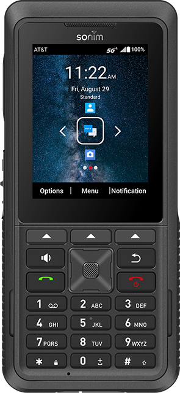
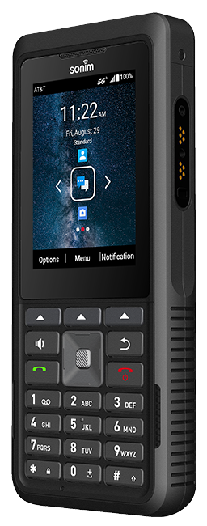
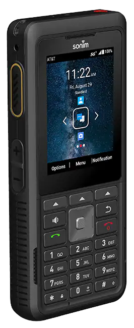
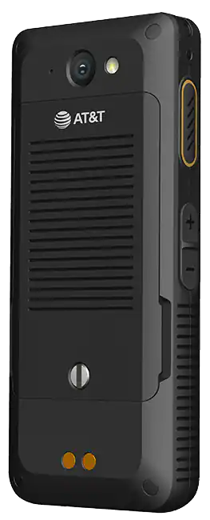
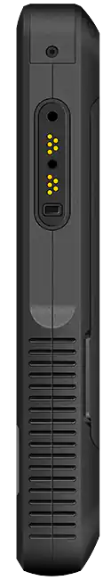

## Sonim does it again

The last time we heard from Sonim was when they released the Sonim Xp3Plus 5G, one of the first 5G dumbphones.
A year later Sonim is back and doing it again, releasing another phone with premium performance and military grade durability.

The successor to the Sonim Xp5900, it's been upgraded with 5G, Android 15, and powerful internals.

While the older Xp5Plus's processor was already impressive, the Xp5Plus 5G takes things to a whole new level.
It's Snapdragon 4 Gen 2 uses Cortex-A78 performance cores, built on a 4nm process, giving it processing power and greater battery efficieny, and surpassing pretty much every dumb/minimalist phone out there, besides for Unihertz's.

It has a 3500 mAh battery, with 15W fast charging. Combined that it's uber effecient processor, and we have a phone that lasts as long as you need it.
 
It's also upgraded with a generous 4 GB of RAM, 64 GB of storage, and a AOSP 15 based OS.

All this comes at a price, and the Xp3Plus 5G sells for $330, which isn't cheap.

- - -

### A closer look

 :::grid

:::

 
 
### The stuff it's made of 

:::details[Full specs]
- **Operating System:** 	Sonim Proprietary OS, **AOSP 15** based
- **Chipset:** 	**Qualcomm SM4450** (2x A78, 2.0GHz, 6x A55, 1.8GHz)
- **Bands:** 	
    - 5G: n2, n5, n7, n14, n25, n28, n38, n41,n48, n66, n71, n77, n78
	- LTE: 1, 2, 3, 4, 5, 7, 8, 12, 13, 14, 20, 25, 26, 28, 29, 30, 38, 41, 42, 43, 48, 66, 71
	- UMTS: I, II, IV, V, VII
- **Ram:** 	**4GB** DDR4

- **Storage:** **64GB** eMMC 
	Supports up to 512GB MicroSD external memory
- **Bluetooth:** 	BT5.0 BLE
- **Languages:**  English, Spanish, Simplified Chinese, Traditional Chinese, Canadian French
- **Battery:** 	**3500mAh** Li-Ion, Removable 15W/18W Fast Charge
- **Display:** **2.8″**, Corning Gorilla Glass 3, 640x480
:::
  
 ### Verdict
 
The Sonim Xp5Plus 5G is a phone with modern internals, in a simple package.
 If you want a phone that's indestructible, has great battery life, modern Android specs, inside of a dumb brick bar form factor, then this is your phone.
 

Overall, this sounds like a terrific phone, and I can't wait to get my hands on it and try it.

https://www.sonimtech.com/products/phones/xp5plus5g

https://www.att.com/buy/phones/sonim-xp5plus-5g-no-knobs.html